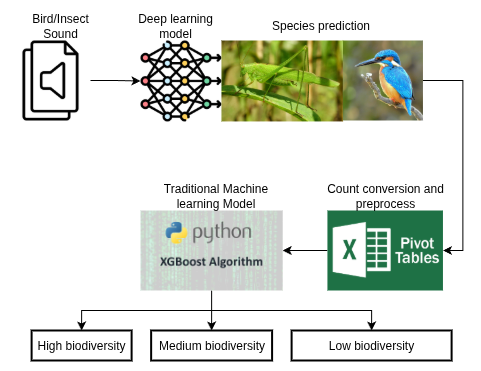
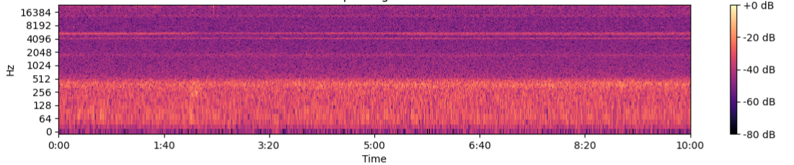

# Biodiversity Score Prediction
## Outlines
- [Overview](#ov)
- [Data](#data)
- [Models](#models)

## **Overview of Biodiversity Score Level Prediction**
This project predicts regional biodiversity scores through a two-stage workflow <a href="#bioscoreoverview">Figure 1</a>: **1. bird and insect sound classification** and the **2. biodiversity score level prediction**.  

1. **Bird and Insect Sound Classification**  
Audio recordings are collected by deployed AudioMoth devices. As illustrated in <a href="#bioscoreoverview">Figure 1</a>, the recordings are preprocessed and fed into a deep learning classifier based on a modified implementation of the [BirdCLEF 2023 4th Place Solution](https://www.kaggle.com/competitions/birdclef-2023/writeups/atfujita-4th-place-solution-knowledge-distillation). The model identifies bird and insect species and also detects non-biological sounds such as human speech, other human-generated noises, and vehicle sounds. It was pre-trained on species recordings from [Xeno-canto](https://xeno-canto.org/) and noise/no-call recordings from our own data collection.
2. **Biodiversity Score Level Prediction**  
For each region, the frequency of occurrence of every detected species and noise class is aggregated from the classified recordings. These frequencies serve as input features to a traditional machine learning model (XGBoost), which predicts the region’s biodiversity score level: high, medium, or low.  

<figure id="bioscoreoverview" style="text-align: center;">
  
  <figcaption>Figure 1: Biodiversity Score Level Prediction Overview.</figcaption>
</figure>

<!-- 

--- -->

## **Data**
This section provides an overview of the data used in this project. We summarize the sources, label quality, use in training, geographic filtering, and the class list.

### Sources
Public: Expert-labeled wildlife audio from [Xeno-canto](https://xeno-canto.org/), covering birds and insects.
Self-collected: Field recordings captured with AudioMoth devices in tea plantations around Chiang Mai, Thailand.
### Audio Data Labels
Xeno-canto recordings include expert-provided species labels.
The self-collected recordings lack ground-truth annotations.
### Data Usage
The sound-classification model is trained primarily on the labeled Xeno-canto data.
Additional noise examples from our self-collected recordings (e.g., human speech, noises from human activity, vehicles, and other environmental noises) are included to improve robustness.
### Geographic filtering
To reduce label noise and improve relevance, we removed species not known to occur in Thailand, with a particular focus on the Chiang Mai region.
### Class list
The final set of bird and insect species used in training and inference is documented in **species.txt** and **species_count.txt**. The number of classes included in the analysis is summarized in [Table 1](#table-1).

Table 1: Summary of the Number of Classes in Training Data
| Type of Sound | Class Count |
|-----------------|-------------------|
| Bird Species | 66 |
| Insect Species | 14 |
| Noise/No-Call | 10 |
| **Total** | **90** |

---

<!-- 
### 2. Model Accuracy

| Metric   | Value |
|----------|-------|
| Accuracy | XX%   |
| Precision| XX%   |
| Recall   | XX%   |
| F1-Score | XX%   |

*(Replace XX% with actual results after training.)*

---
 -->

## **Models**

### Sound Classification Model
The audio classification model is adapted from [4th Place Solution: Knowledge Distillation Is All You Need](https://www.kaggle.com/competitions/birdclef-2023/writeups/atfujita-4th-place-solution-knowledge-distillation). The modified version of the model can be found at [Biodiversity Audio Classification](https://github.com/diwas-lamsal/biodiversity-audio?tab=readme-ov-file).

- **Input:**
  - Each collected raw audio file contains 10 minutes length which is then splitted into 20 second-chunks. Mel-spectrograms (<a href="#melspectrogram">Figure 2</a>) are extracted from audio chunks and they serve as the input of the audio classification model training.

<figure id="melspectrogram" style="text-align: center;">
  
  <figcaption>Figure 2: An Example of Mel Spectrogram.</figcaption>
</figure>

- **Model Backbone:**
  -  Convolutional Neural Networks (CNNs) for spatial feature learning. eg. ResNet, EfficientNet.
- **Training Details:**
  - Optimizer: *AdamW*
  - Loss: *BCEWithLogitsLoss*
  - Learning Rate: *2.5e-4 (with Cosine Learning Rate Scheduler)*
  - Epochs: *200*
  - Batch Size: *32*
- **Output:**
  - The model produces a prediction indicating the class ID of the species with the highest probability in the input audio chunk. The class IDs range from 0 to 89 (totaling 90 classes), and the final prediction maps the class ID to the corresponding species name.

### Biodiversity Score Level Prediction Model
The biodiversity score level is categorized into low, medium and high according to the location of the area from which we map them into class IDs of 0 to 2 respectively. We use XGBoost Classification Model to predict the final biodiversity score level. The training and validation datasets are split based on device ID to ensure that recordings from the same device do not appear in both sets, thereby preventing data leakage and maintaining the integrity of the validation process.

- **Input:**
  - The outputs from the audio classification model, along with their respective timestamps, are converted into a pivot table, [Table 2](#table-2), based on frequency count, with each column representing a species name or noise classification. From this pivot table, we extract the frequency of occurrence for each species at specific timestamps. These occurrences are then aggregated into hourly counts for each species. The final input is a table displaying the hourly appearance of each species, which is mapped to its corresponding biodiversity score level, [Table 3](#table-3).

Table 2: Example of Pivot Table for Species Frequency Count
| No | unique_date | collected_biodiversity_score | hour | species_1 | species_2 | ... | species_x |
|-----------------|-------------------|-------------------|-------------------|-------------------|-------------------|-------------------|-------------------|
| 0 | model5_2025-01-27 | 0 | 1 | 0 | 2 | ... | 1 |
| 1 | model4_2025-01-28 | 1 | 0 | 0 | 0 | ... | 0 |
| 2 | model1_2025-01-29 | 2 | 3 | 1 | 0 | ... | 2 |

- **Training Details:**
  - Model: XGBoost Classifier
  - Hyperparameter Search: GridSearch
  - Best Num Features: 60

- **Training**
  - The detail training settings and codebase can be found in `training.ipynb`(or training.pdf)
  - For data insight and data analysis, please refer to `analysis.ipynb`(or analysis.pdf)

Table 3: Mapping Between Biodiversity Score Level and Class ID
| Biodiversity Score Level | Class ID |
|-----------------|-------------------|
| Low | 0 |
| Medium | 1 |
| High | 2 |

---

