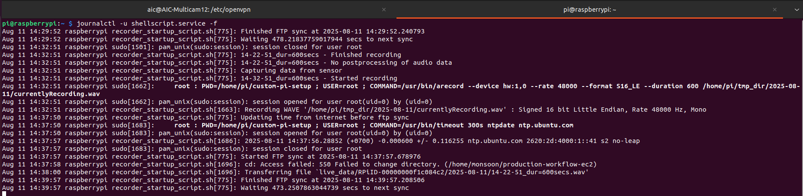

# Hardware Components Documentation

## 1. IoT Device List

The following devices are used in the system:

1. **Raspberry Pi**  
2. **AudioMoth**  
3. **4G Router**  
4. **Internet SIM Card**  
5. **Solar Panel**

<!-- 
  
  
  
 -->

---

## 2. Raspberry Pi — OS & Installation

- **Model:** Raspberry Pi 3 B+  
- **Storage:** 64 GB microSD card  
- **Setup:** Flash the backup OS image to the new SD card.  

**Installation Process:**

1. Insert the SD card into your computer.  
2. Use an imaging tool (e.g., Balena Etcher) to flash the backup `.img` file.  
3. Insert the flashed SD card into the Raspberry Pi.  
4. Power on the device.

| Raspberry Pi | SD Card |
|--------------|---------|
|  |  |


[[Download pi-image here]](https://drive.google.com/drive/folders/19RC69tCjV7lfupJODWT0BL_QIx_DtFqr)

## Configuration File

After the flashing the new image to the sd card insert the raspberry pi and check the process. 
username and password should be according to the user's favourite

We used username - pi and password - raspberry for all devices.

---

VPN configuration

for every raspbeery pi have every ovpn account 

# OpenVPN Account Setup Verification (Converted from `.ovpn`)

This guide explains how to verify an OpenVPN account that has been **converted from `.ovpn` to `.conf`** format on a Raspberry Pi.

---

## 1. Locate OpenVPN Config Files

Navigate to the OpenVPN directory:

```bash
cd /etc/openvpn/
ls
```

Expected files:

```file
client/
credentials.txt
openvpn_MONSOON_TEA05.conf
server/
update-resolv-conf
```

- openvpn_MONSOON_TEA05.conf → Converted OpenVPN client config (original .ovpn file).
- credentials.txt → Stores VPN username & password.


2. Confirm Credentials File
Open and check credentials.txt:

```bash
cat /etc/openvpn/credentials.txt
Format (two lines only):
vpn_username
vpn_password
```

For Setting secure permissions:

```bash
sudo chmod 600 /etc/openvpn/credentials.txt
```
---

Setting up the vpn  (example)


```
sudo systemctl enable openvpn@openvpn_MONSOON_TEA05
sudo systemctl start openvpn@openvpn_MONSOON_TEA05
```

Connect to the VPN 

```
sudo openvpn --config openvpn_MONSOON_TEA05.ovpn
```

after checking it with `ifconfig`

vpn tunnel should be opened and pointed to `10.81.234.5`


---
Below is an example `config.json` file:

```json
{
    "ftp": {
        "uname": "monsoon",
        "pword": "p8z3%1P#04",
        "host": "192.168.70.5/production-workflow-ec2",
        "use_ftps": 1
    },
    "offline_mode": 0,
    "sensor": {
        "sensor_index": 2,
        "sensor_type": "USBSoundcardMic",
        "record_length": 600,
        "compress_data": false,
        "capture_delay": 0
    },
    "sys": {
        "working_dir": "/home/pi/tmp_dir",
        "upload_dir": "/home/pi/continuous_monitoring_data",
        "reboot_time": "02:00"
    },
    "device_id": "00000000f1c084c2"
}
```
---
Below is the example shell script for the recording the pi 24/7 automatically.

```ini
[Unit]
Description=My Shell Script

[Service]
ExecStart=/home/pi/custom-pi-setup/recorder_startup_script.sh

[Install]
WantedBy=multi-user.target
```
---
To monitor the **recorder service** in real time:

```bash
journalctl -u shellscript.service -f
```




### 2.1. Important Scripts & Files

The Raspberry Pi OS contains key scripts and configurations:

| File / Service            | Description |
|---------------------------|-------------|
| `recorder-script.sh`      | Main script to handle audio recording. |
| `config.json`             | Configuration file for device parameters. |
| OpenVPN installation (UI) | Provides secure remote access. |
| `journalctl -u shellscript.service -f` | Command to check live service logs. |
| `arecord -l`               | Command to list available recording devices. |

---

## 3. AudioMoth Device

AudioMoth is a low-cost, full-spectrum acoustic logger, based on the Gecko processor range from Silicon Labs. Just like its
namesake the moth, AudioMoth can listen at audible frequencies, well into ultrasonic frequencies. It is capable of recording
uncompressed audio to microSD card at rates from 8,000 to 384,000 samples per second. The AudioMoth is used for audio data collection in **two modes**:


### 3.1. Mobile Type Usage
- Portable configuration for temporary deployments.  
- Ideal for short-term surveys.  
- See attached manual for setting up the mobile type Audiomoth.

[Download Audiomoth setup manual PDF](files/Audiomoth mobile type recording Manual.pdf)

### 3.2. Station Type Usage
- Fixed position setup for continuous monitoring.  
- Powered by solar and external battery.  
- See attached manual for setting up the IOT station type.

[Download Whole IOT device setup PDF version](files/Setting Up IoT Station Devices.pdf)

---

## 4. Router Status

- **Type:** 4G Router  
- **Function:** Provides internet connectivity via SIM card.  

**Troubleshooting:**
- Check LED status indicators.  
- Ensure SIM card is active.  
- Restart router if connection drops.

  

---

## 5. Solar Panel Status

- **Purpose:** Supplies power to IoT devices in remote areas.  

**Indicators:**
- Green light: Charging  
- Red light: Low battery  
- Off: No power supply


---

## 6. Battery Status

- **Purpose:** Stores energy for nighttime or cloudy-day operation.  

**LED/Blink Indicators:**

- 1 blink: Low power  
- 2 blinks: Medium  
- 3 blinks: Fully charged  


---

## 7. Overall Working Flow

1. **Power Supply:** Solar panel → Battery → Raspberry Pi + Router.  
2. **Data Capture:** AudioMoth / Pi records data.  
3. **Data Transmission:** Router sends data over 4G network.  
4. **Remote Access:** OpenVPN connection to retrieve/manage data.  
5. **Monitoring:** Logs checked via `journalctl` or SSH commands.

  

