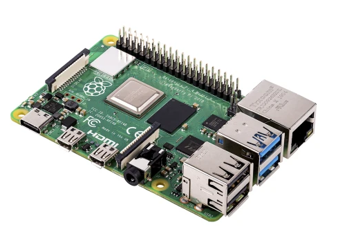
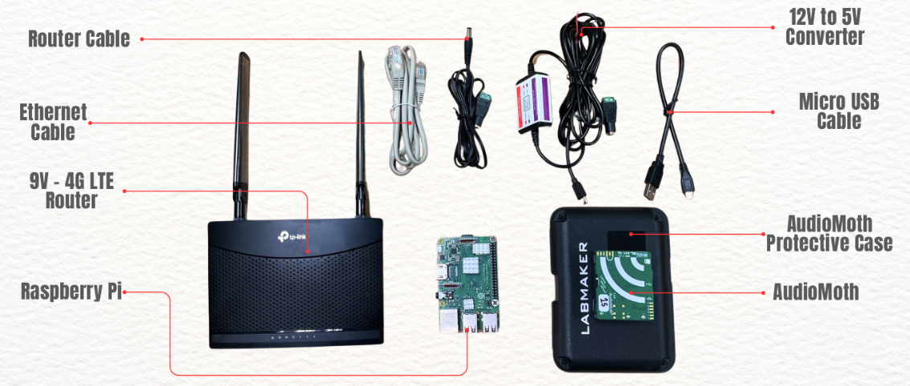

# **Hardware Components & Setup Documentation**

---

## **1. Device List**

This system consists of the following IoT hardware components:

1. **Raspberry Pi 3 B+** (64 GB microSD storage)  
2. **AudioMoth** (Acoustic logger)  
3. **4G Router** (with SIM card)  
4. **Internet SIM Card**  
5. **Solar Panel** (with battery storage)  

---

## **2. Raspberry Pi Setup**

### **2.1. Hardware**
- **Model:** Raspberry Pi 3 B+  
- **Storage:** 64 GB microSD card  

---

### **2.2. OS Installation**
1. Insert the SD card into your computer.  
2. Use **Balena Etcher** (or similar) to flash the provided `.img` backup OS image.  
3. Insert the flashed SD card into the Raspberry Pi.  
4. Power on the device.  

| Raspberry Pi | SD Card |
|--------------|---------|
|  |  |

📥 **[Download Raspberry Pi OS Image](https://drive.google.com/drive/folders/19RC69tCjV7lfupJODWT0BL_QIx_DtFqr)**

---

### **2.3. Login Credentials**
Default credentials (can be customized):  
- **Username:** `pi`  
- **Password:** `raspberry`  

---

## **3. VPN Configuration**

Each Raspberry Pi has its own OpenVPN account.

### **3.1. File Structure**
Navigate to the OpenVPN directory:

```bash
cd /etc/openvpn/
ls
```

Expected files:
```
client/
credentials.txt
openvpn_MONSOON_TEA05.conf
server/
update-resolv-conf
```

- **`openvpn_MONSOON_TEA05.conf`** → Converted `.ovpn` client config file  
- **`credentials.txt`** → VPN username & password (two lines only)

---

### **3.2. Credentials Setup**
Check credentials:
```bash
cat /etc/openvpn/credentials.txt
```
Format:
```
vpn_username
vpn_password
```
Secure file permissions:
```bash
sudo chmod 600 /etc/openvpn/credentials.txt
```

---

### **3.3. VPN Service Setup**
Enable & start service:
```bash
sudo systemctl enable openvpn@openvpn_MONSOON_TEA05
sudo systemctl start openvpn@openvpn_MONSOON_TEA05
```

Manual connect:
```bash
sudo openvpn --config openvpn_MONSOON_TEA05.ovpn
```

Verify connection:
```bash
ifconfig
```
VPN tunnel should point to `10.81.234.5`.

---

## **4. Device Configuration File**

Example **`config.json`**:
```json
{
    "ftp": {
        "uname": "monsoon",
        "pword": "p8z3%1P#04",
        "host": "192.168.70.5/production-workflow-ec2",
        "use_ftps": 1
    },
    "offline_mode": 0,
    "sensor": {
        "sensor_index": 2,
        "sensor_type": "USBSoundcardMic",
        "record_length": 600,
        "compress_data": false,
        "capture_delay": 0
    },
    "sys": {
        "working_dir": "/home/pi/tmp_dir",
        "upload_dir": "/home/pi/continuous_monitoring_data",
        "reboot_time": "02:00"
    },
    "device_id": "00000000f1c084c2"
}
```

---

## **5. Automatic Recording Service**

Example **systemd service** (`/etc/systemd/system/shellscript.service`):
```ini
[Unit]
Description=My Shell Script

[Service]
ExecStart=/home/pi/custom-pi-setup/recorder_startup_script.sh

[Install]
WantedBy=multi-user.target
```

Check live service logs:
```bash
journalctl -u shellscript.service -f
```

---

## **6. Important Commands**
| Command | Purpose |
|---------|---------|
| `arecord -l` | List available recording devices |
| `journalctl -u shellscript.service -f` | Live monitoring of recording service |
| `sudo systemctl restart shellscript.service` | Restart recording service |

---

## **7. AudioMoth Setup**

### **7.1. Overview**
AudioMoth is a low-cost, full-spectrum acoustic logger, based on the Gecko processor range from Silicon Labs.  
It can record **audible and ultrasonic frequencies** at rates from **8,000 to 384,000 samples/sec**.  
It is used in two modes: **mobile** and **station**.

---

### **7.2. Modes**
#### **Mobile Type**
- Portable configuration for temporary deployments  
- Ideal for short-term surveys  
📄 **[Download Mobile AudioMoth Manual (PDF)](files/Audiomoth%20mobile%20type%20recording%20Manual.pdf)**  

#### **Station Type**
- Fixed position setup for continuous monitoring  
- Powered by solar & external battery  
📄 **[Download IoT Station Setup Manual (PDF)](files/Setting%20Up%20IoT%20Station%20Devices.pdf)**  

---

## **8. Router Setup & Troubleshooting**

- **Type:** 4G Router with SIM  
- **Purpose:** Internet connection for remote locations  

**Troubleshooting Checklist:**
1. Check LED status indicators  
2. Ensure SIM card is active  
3. Restart router if connection drops  

---

## **9. Solar Panel & Battery**

### **Solar Panel**
- Powers IoT devices in remote areas  
- **Indicators:**  
  - Green → Charging  
  - Red → Low battery  
  - Off → No power  

### **Battery**
- Stores energy for night/cloudy use  
- **Blink Indicators:**  
  - 1 blink → Low  
  - 2 blinks → Medium  
  - 3 blinks → Full  

---

## **10. System Workflow**

1. **Power Supply** → Solar Panel → Battery → Raspberry Pi & Router  
2. **Data Capture** → AudioMoth or Raspberry Pi records audio  
3. **Data Transmission** → Router sends via 4G  
4. **Remote Access** → VPN connection for management  
5. **Monitoring** → Logs checked via `journalctl` or SSH  

