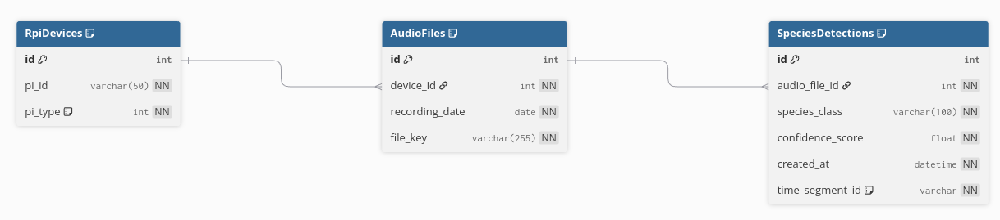

# Biodiversity Audio Inference Pipeline

A real-time audio monitoring and species detection system for biodiversity research using deep learning models and Raspberry Pi devices.

## Overview

This pipeline processes audio recordings from field-deployed Raspberry Pi devices to automatically detect and classify bird species and other wildlife sounds. It uses a pre-trained deep learning model to analyze audio spectrograms and identify species with confidence scores.


## Architecture

### Core Components

- **Audio Processing**: Real-time audio file monitoring and processing using librosa
- **Deep Learning Model**: Attention-based neural network for species classification
- **Database**: SQLite database for storing detections, audio metadata, and device information
- **File Monitoring**: Watchdog-based file system monitoring for automatic processing
- **Docker Support**: Containerized deployment for development and production

### Model Architecture

The system uses an `AttModel` class that combines:
- **Backbone**: Pre-trained vision models (configurable via timm)
- **Mel-spectrogram extraction**: Audio preprocessing with configurable parameters
- **Attention mechanisms**: For temporal and frequency domain feature learning
- **Classification head**: Multi-class species prediction with confidence scoring

## Project Structure

```
inference-pipeline/
├── app-data/                    # Database files
├── audio-data/                  # Input audio recordings
├── docker/                      # Docker configuration files
├── json-output/                 # Prediction results and reports
├── logs/                        # Application logs
├── monsoon_biodiversity_common/ # Core library modules
│   ├── config.py               # Model and system configuration
│   ├── dataset.py              # Data loading and preprocessing
│   ├── db_model.py             # Database models and schema
│   ├── model.py                # Neural network architecture
│   └── requirements.txt        # Core dependencies
├── scripts/                     # Utility and deployment scripts
├── src/                         # Main application source code
│   ├── debug_audio_monitoring.py    # Real-time audio monitoring
│   ├── debug_process_detections.py  # Detection processing and reporting
│   ├── inference_station.py         # Station-specific inference
│   ├── query.py                     # Database query utilities
│   └── species_mapping.py           # Species classification mapping
├── weights/                     # Pre-trained model weights
└── requirements.txt             # Main project dependencies
```

## Quick Start

### Prerequisites

- Python 3.8+
- Docker (optional, for containerized deployment)
- Audio processing libraries (librosa, torchaudio)
- Deep learning framework (PyTorch)

### Installation

1. **Clone the repository**
This one is already clone at iNET (server4 machine)

   ```bash
   git clone <repository-url>
   cd inference-pipeline
   git submodule update --init --recursive 
   ```

2. **Download model weights**
The weights are already uploaded to the iNET and attached to the drive as well

   - Place `soundscape-model.pt` file in the `weights/` directory
   - sound-scape.pt = sound classification model 
   - xgboost-model.pkl = score prediction model 
   - Ensure the model architecture matches the configuration in `monsoon_biodiversity_common/config.py`

3. **Setup database**
   ```bash
   # The database will be automatically initialized on first run
   python src/debug_audio_monitoring.py
   ```

### Docker Deployment

1. **Build production image**
   ```bash
   ./scripts/build_prod_image.sh
   ```

2. **Run with docker-compose**
   ```bash
   cd docker
   docker-compose -f docker-compose-devel.yaml up -d
   ```

3. **Access container**
   ```bash
   docker exec -it dev-bio-diversity bash
   ```

4. **Run script**
   ```bash
   sh run.sh
   ```
   it will run the audio-monitoring.py and process_detection.py and the intention of those python script will be explained below session

## Configuration


### Database

This is how the conceptual diagram works inside the inference data accepting




### Model Configuration

Edit `monsoon_biodiversity_common/config.py` to customize:

- **Audio parameters**: Sample rate, mel bands, FFT settings
- **Model architecture**: Backbone model, number of classes
- **Training settings**: Learning rate, batch size, epochs


## Usage

### Real-time Audio Monitoring

Start the audio monitoring service:

```bash
python src/audio_monitoring.py
```

This service:
- Monitors audio directories for new files
- Processes audio files through the species detection model
- Stores results in the database
- Generates real-time logs

### Batch Processing

Process existing audio files:

```bash
python src/inference_station.py
```

### Query Results

Query detection results from the database:

```bash
python src/query.py
```

### Daily Reports

Generate daily detection summaries:

```bash
python src/debug_process_detections.py --schedule
```

## Database Schema

### Core Tables

- **RpiDevices**: Device information and metadata
- **AudioFiles**: Audio file records and metadata
- **SpeciesDetections**: Detection results with confidence scores

### Query Examples

```python
from src.query import query_species_by_device_and_dates

# Query detections for specific device and dates
results = query_species_by_device_and_dates(
    engine, 
    "RPiID-0000000081519079", 
    ["2025-04-23", "2025-04-22"]
)
```

## Output Formats

### Detection Results

Species detections are stored with:
- Audio file reference
- Species classification
- Confidence score
- Temporal segment information
- Device and timestamp metadata

### Log Files

- `audio_inference.log`: Real-time processing logs
- `batch_audio_inference.log`: Batch processing logs
- `daily_report.log`: Daily summary reports

## Troubleshooting

### Common Issues

1. **Model weights not found**
   - Ensure `soundscape-model.pt` is in the `weights/` directory
   - Check file permissions and paths

2. **Audio directory not accessible**
   - Verify audio data directory exists and is readable
   - Check Docker volume mounts if using containers

3. **Database connection errors**
   - Ensure SQLite database directory is writable
   - Check database file permissions
